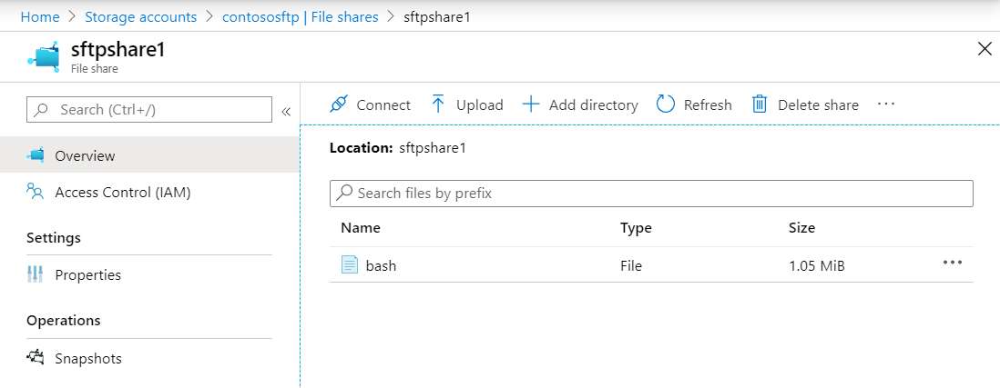

# SFTP container solution for Azure
With the Azure Resource Manager template here you can deploy public or private container instances and provide a PaaS-like SFTP service to clients, backed by Azure File storage.

These templates build upon the work done here:

https://github.com/Azure-Samples/sftp-creation-template

and add features such as:
* A arbitrary number of SFTP users and file shares can be used
* Password hashes instead of cleartext

## Getting started

To get started you will need:

1. A storage account containing one Azure file share for each SFTP user you want to set up
2. `[Private container only]` A VNET with a subnet delegated to container groups (Microsoft.ContainerInstance/containerGroups)

## Parameter inputs

To deploy the SFTP container you need to specify:

### Public container

1. Container group name
2. Container group DNS label
3. Resource group containing the storage account
4. Storage account name
5. List of users, password hashes and file shares

See file [`sftp_public.parameter.json`](sftp_public.parameter.json) for an example.

### Private container in VNET

1. Container group name
2. Resource group containing the VNET
3. VNET name
4. Subnet name
5. Resource group containing the storage account
6. Storage account name
7. List of users, password hashes and file shares

See file [`sftp_private.parameter.json`](sftp_private.parameter.json) for an example.

## Password hashes

Passwords in the parameter file should be supplied as SHA-512 base64 hash values. You can generate such values using `mkpasswd` or `openssl` utilities as follows:

~~~~
# mkpasswd -m sha-512
Password:
$6$isJXoOazUKjnH$N8H3Q2G95hv.k3fGufPg4GwCeHNTtL9rDUlcAZY3ipMGezHCwu/3VCuAEG5xuVjrEpqhSsUHBGkyZBis7Cktw1
~~~~

(`mkpasswd` is a part of the `whois` package on Ubuntu)

or

~~~~
# openssl passwd -6 -stdin
Password:
$6$l0JAkJW2$MDTj2Ad0xU8EzLeHamycYVRvroaEcYnd56kr2wULbeqic2lQXeQsBXLtKtKBDOHuFufcEZ/NVzENPV16GVNSf1
~~~~

**Important:** Append suffix ":e" to the value when you add it to the parameter file.

If you don't have an Ubuntu system to run these commands on, you can deploy a simple Ubuntu container with the mkpasswd utility installed. Use template [`mkpasswd.json`](mkpasswd.json) to do this. Connect to the container through Azure Portal.

## Working example

Follow the steps below to create a sample public SFTP container with five users. The steps for a private container are similar - you just need to add the VNET details to the parameters.

### 1. Prepare storage account

Set up an Azure storage account in the desired region. Create five Azure File shares. For simplicity you can give them the same names as the SFTP users, but in this example they are different. `sftpuser1` maps to file share `sftpshare1` and so on.

### 2. Prepare password hashes

Use the `mkpasswd` tool to generate a password hash for each user. You should keep the cleartext passwords in a secure place.

~~~~
# mkpasswd -m sha-512
Password:
$6$K5KDRPrPREWdNMd$lWVDgLDayM6YUS6/W92tkXDF/BUC355QgjVA4vktOb1.zPDP5HbILMr41E1uHiTkr0s4YTw56/thE6N7Xw93i1
# mkpasswd -m sha-512
Password:
$6$dq7YuXivSER$geeIXalZDnJ2sDi2/0rrrTOPPhkVu5Hb02YhO5KhLJaCktj4Jfg55cgFGcJkCwgbG4RjyznXbXs61OyD4GafP.
# mkpasswd -m sha-512
Password:
$6$W7XFrIrEKte$XrOcZKsjhnnrvfnvVPs9egv5Cyi9XZVzvrkEpHsM30p5urMyS.aB875o3JRvC1U5WP/hRHCUIKC7gA0fBGCaF1
# mkpasswd -m sha-512
Password:
$6$XQJ0ZE1ULTOi/Xs$EHNW5j0.UAHnE2Iy1GN/5Vf3Tg3nufmqWeGVJ8H/qtT5O7Fzg2/uDTnSLg/CRQlNRsd.Dpo5KNtwc8OcZ4Zx7.
# mkpasswd -m sha-512
Password:
$6$fqzWKSUa5M$Nn0vVwSJCgvmwKQyytnk5lVJZHgi20niDh4/s4BqGsWcD0L/tAEVTXhjDOrDqSC3rKSBVFxrsCVrqCiqZCTdz0
~~~~

### 3. Populate the parameter file

~~~~
{
    "$schema": "https://schema.management.azure.com/schemas/2015-01-01/deploymentParameters.json#",
    "contentVersion": "1.0.0.0",
    "parameters": {
        "containerGroupName": {
            "value": "sftp-public-group"
        },
        "containerGroupDnsLabel": {
            "value": "contoso-sftp"
        },
        "storageAccountResourceGroup": {
            "value": "sftp-rg1"
        },
        "storageAccountName": {
            "value": "contososftp"
        },
        "users": {
            "value": {
                "credentials": [
                    {
                        "userName": "sftpuser1",
                        "passwordHash": "$6$K5KDRPrPREWdNMd$lWVDgLDayM6YUS6/W92tkXDF/BUC355QgjVA4vktOb1.zPDP5HbILMr41E1uHiTkr0s4YTw56/thE6N7Xw93i1:e",
                        "fileShare": "sftpshare1"
                    },
                    {
                        "userName": "sftpuser2",
                        "passwordHash": "$6$dq7YuXivSER$geeIXalZDnJ2sDi2/0rrrTOPPhkVu5Hb02YhO5KhLJaCktj4Jfg55cgFGcJkCwgbG4RjyznXbXs61OyD4GafP.:e",
                        "fileShare": "sftpshare2"
                    },
                    {
                        "userName": "sftpuser3",
                        "passwordHash": "$6$W7XFrIrEKte$XrOcZKsjhnnrvfnvVPs9egv5Cyi9XZVzvrkEpHsM30p5urMyS.aB875o3JRvC1U5WP/hRHCUIKC7gA0fBGCaF1:e",
                        "fileShare": "sftpshare3"
                    },
                    {
                        "userName": "sftpuser4",
                        "passwordHash": "$6$XQJ0ZE1ULTOi/Xs$EHNW5j0.UAHnE2Iy1GN/5Vf3Tg3nufmqWeGVJ8H/qtT5O7Fzg2/uDTnSLg/CRQlNRsd.Dpo5KNtwc8OcZ4Zx7.:e",
                        "fileShare": "sftpshare4"
                    },
                    {
                        "userName": "sftpuser5",
                        "passwordHash": "$6$fqzWKSUa5M$Nn0vVwSJCgvmwKQyytnk5lVJZHgi20niDh4/s4BqGsWcD0L/tAEVTXhjDOrDqSC3rKSBVFxrsCVrqCiqZCTdz0:e",
                        "fileShare": "sftpshare5"
                    }
                ]
            }
        }
    }
}
~~~~

### 4. Deploy the template (PowerShell example)

~~~~
PS > $resourceGroup="sftp-rg1"
PS > New-AzResourceGroupDeployment -Name contoso-sftp-public -ResourceGroupName $resourceGroup -TemplateFile sftp_public.json -TemplateParameterFile sftp_public_contoso.parameters.json

DeploymentName          : contoso-sftp-public
ResourceGroupName       : sftp-rg1
ProvisioningState       : Succeeded
Timestamp               : 2020-04-08 13:31:57
Mode                    : Incremental
TemplateLink            :
Parameters              :
                          Name                           Type                       Value
                          =============================  =========================  ==========
                          containerGroupName             String                     sftp-public-group
                          containerGroupDnsLabel         String                     contoso-sftp
                          storageAccountResourceGroup    String                     sftp-rg1
                          storageAccountName             String                     contososftp
                          users                          SecureObject

Outputs                 :
                          Name                 Type                       Value
                          ===================  =========================  ==========
                          containerDNSLabel    String                     contoso-sftp.westus2.azurecontainer.io

DeploymentDebugLogLevel :
~~~~

### 5. Connect to the running container and check the mount points

~~~~
root@wk-caas-b5920ec3f4e64b32a70385c0bfcc17eb-2a19c01254dad6aa17949c:/# df -h
Filesystem                                      Size  Used Avail Use% Mounted on
overlay                                          49G   10G   39G  21% /
tmpfs                                           954M     0  954M   0% /dev
tmpfs                                           954M     0  954M   0% /sys/fs/cgroup
/dev/sda1                                        49G   10G   39G  21% /etc/hosts
tmpfs                                           954M  4.0K  954M   1% /var/aci_metadata
shm                                              64M     0   64M   0% /dev/shm
//contososftp.file.core.windows.net/sftpshare4  1.0G     0  1.0G   0% /home/sftpuser4/upload
//contososftp.file.core.windows.net/sftpshare5  1.0G     0  1.0G   0% /home/sftpuser5/upload
//contososftp.file.core.windows.net/sftpshare1  1.0G     0  1.0G   0% /home/sftpuser1/upload
//contososftp.file.core.windows.net/sftpshare2  1.0G     0  1.0G   0% /home/sftpuser2/upload
//contososftp.file.core.windows.net/sftpshare3  1.0G     0  1.0G   0% /home/sftpuser3/upload
tmpfs                                           954M     0  954M   0% /sys/firmware
root@wk-caas-b5920ec3f4e64b32a70385c0bfcc17eb-2a19c01254dad6aa17949c:/#
~~~~

Mount point `/upload` can be changed to anything you like by adjusting the template. It's not possible to mount a share directly as a user's home directory.

### 6. Perform a test SFTP connect and upload a file

~~~~
# sftp sftpuser1@contoso-sftp.westus2.azurecontainer.io
sftpuser1@contoso-sftp.westus2.azurecontainer.io's password:
Connected to contoso-sftp.westus2.azurecontainer.io.
sftp> ls -l
drwxrwxrwx    2 0        0               0 Apr  8 13:31 upload
sftp> cd /upload
sftp> put /bin/bash
Uploading /bin/bash to /upload/bash
/bin/bash                                                                 100% 1073KB  20.1MB/s   00:00
sftp> quit
~~~~

### 7. Check that the file has landed in the storage account

