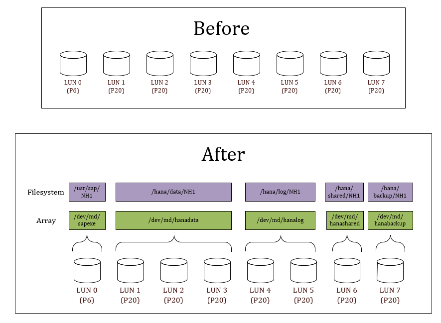
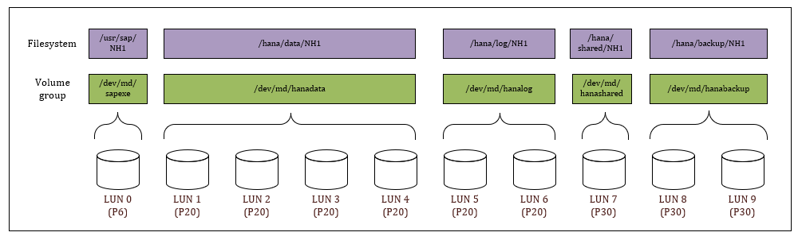

# mdadm automation for SAP systems
## Introduction
With this script you can automate the creation of mdadm arrays and filesystems for SAP systems. By providing a configuration file that describes the desired state you can finely control which filesystems are created and on disks they are located. Filesystems are always striped across the maximum number of disks to achieve the best performance.

## Example

## Calling syntax
~~~~
mdadm4sap.sh -s <SAPSID> -t <configfile>
~~~~

`<configfile>` is the path to the configuration file. This can be a local file or a file accessible via http/https.

`<SAPSID>` is the SID of the SAP system. Wherever the program finds "SID" or "sid" in the configuration file, it will replace them with this value.

Examples:
~~~~
mdadm4sap.sh -s NH1 -t /sapmedia/scripts/disk/hana_prod_m32ts
~~~~
~~~~
mdadm4sap.sh -s ND1 -t https://raw.githubusercontent.com/dohughes-msft/sap/master/bash/disk/diskconfig-mdadm/hana_prod_m32ts
~~~~

## Configuration file
The configuration file must contain two sections with an empty line inbetween.

1. A section named `[volumes]` that contains a comma-separated list of:
    * LUN (as known by Azure i.e. 0, 1, 2, etc.)
    * array name

2. A section named `[filesystems]` that contains a comma-separated list of:
    * array name (corresponding to the previous section)
    * filesystem name

### Simple example - SAP application server
The simplest possible configuration file looks like this:

~~~~
[arrays]
0,sapexe

[filesystems]
sapexe,/usr/sap/SID
~~~~

Running the program with this configuration and parameter `SID = NH1` will result in:

* array `/dev/md/sapexe` created on a partition on disk 0 (`/dev/disk/azure/scsi1/lun0-part1`)
* a filesystem named `/usr/sap/NH1` on this array

### More complex example - HANA database server on an M64s virtual machine

~~~~
[arrays]
0,sapexe
1,hanadata
2,hanadata
3,hanadata
4,hanadata
5,hanalog
6,hanalog
7,hanashared
8,hanabackup
9,hanabackup

[filesystems]
sapexe,/usr/sap/SID
hanadata,/hana/data/SID
hanalog,/hana/log/SID
hanashared,/hana/shared/SID
hanabackup,/hana/backup/SID
~~~~

The result in this case if we keep `SID = NH1` is:

## Pre-made configuration files
In folder `diskconfig-mdadm` you will find pre-made configuration files for HANA and application servers. The HANA configurations correspond to the Microsoft-recommended storage configurations found at:

https://docs.microsoft.com/en-us/azure/virtual-machines/workloads/sap/hana-vm-operations-storage