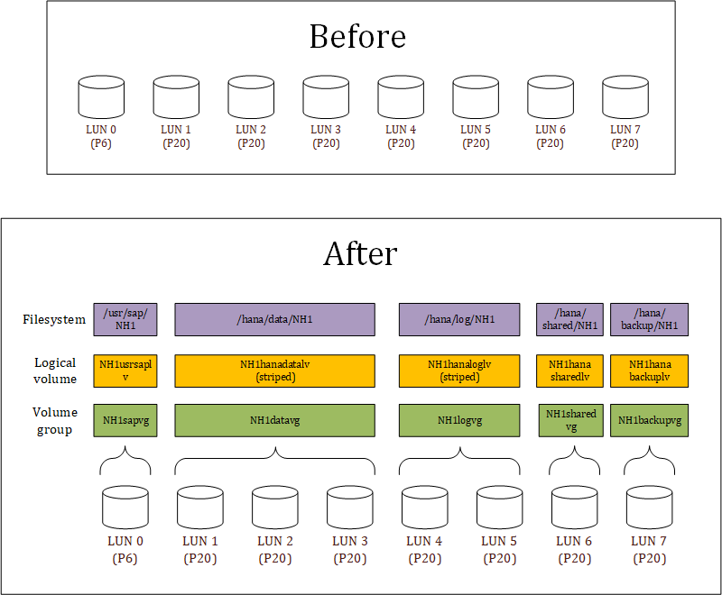
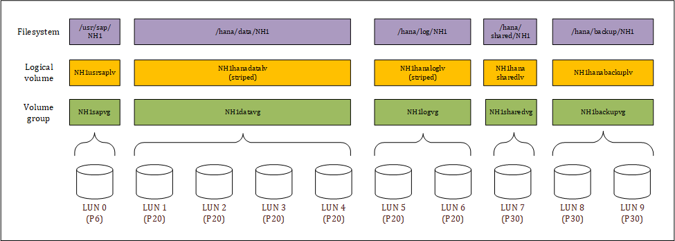

# LVM automation for SAP systems
## Introduction
With the bash scripts in this folder you can automate the creation of volume groups, logical volumes, and filesystems for SAP systems. By providing a configuration file that describes the desired state you can finely control which filesystems are created and on which volumes and disks they are located. Filesystems are always striped across the maximum number of disks to achieve the best performance.

## Example

## Calling syntax
~~~~
lvm4sap.sh -s <SAPSID> -t <configfile>
~~~~

`<configfile>` is the path to the configuration file. This can be a local file or a file accessible via http/https.

`<SAPSID>` is the SID of the SAP system. Wherever the program finds "SID" or "sid" in the configuration file, it will replace them with this value.

Examples:
~~~~
lvm4sap.sh -s NH1 -t /sapmedia/scripts/disk/hana_prod_m32ts
lvm4sap.sh -s ND1 -t https://raw.githubusercontent.com/dohughes-msft/sap/master/bash/lvm/diskconfig/db2_standard
~~~~

## Configuration file
The configuration file must contain two sections with an empty line inbetween.

1. A section named `[volumegroups]` that contains a comma-separated list of:
    * LUN (as known by Azure i.e. 0, 1, 2, etc.)
    * volume group

2. A section named `[filesystems]` that contains a comma-separated list of:
    * volume group (corresponding to the previous section)
    * logical volume name
    * filesystem name
    * filesystem size as a percentage of the total space in the volume group

### Simple example - SAP application server
The simplest possible configuration file looks like this:

~~~~
[volumegroups]
0,SIDsapvg

[filesystems]
SIDsapvg,SIDusrsaplv,/usr/sap/SID,100
~~~~

Running the program with this configuration and parameter `SID = NH1` will result in:

* volume group `NH1sapvg` created on disk 0 (`/dev/disk/azure/scsi1/lun0`)
* logical volume `NH1usrsaplv` sized to 100% of the volume group size
* a filesystem named `/usr/sap/NH1` on this logical volume

### More complex example - HANA database server on an M64s virtual machine

~~~~
[volumegroups]
0,SIDsapvg
1,SIDdatavg
2,SIDdatavg
3,SIDdatavg
4,SIDdatavg
5,SIDlogvg
6,SIDlogvg
7,SIDsharedvg
8,SIDbackupvg
9,SIDbackupvg

[filesystems]
SIDsapvg,SIDusrsaplv,/usr/sap/SID,100
SIDdatavg,SIDhanadatalv,/hana/data/SID,100
SIDlogvg,SIDhanaloglv,/hana/log/SID,100
SIDsharedvg,SIDhanasharedlv,/hana/shared/SID,100
SIDbackupvg,SIDhanabackuplv,/hana/backup/SID,100
~~~~

The result in this case if we keep `SID = NH1` is:

## Pre-made configuration files
In folder `diskconfig` you will find pre-made configuration files for HANA, AnyDB and application servers. The HANA configurations correspond to the Microsoft-recommended storage configurations found at:

https://docs.microsoft.com/en-us/azure/virtual-machines/workloads/sap/hana-vm-operations-storage